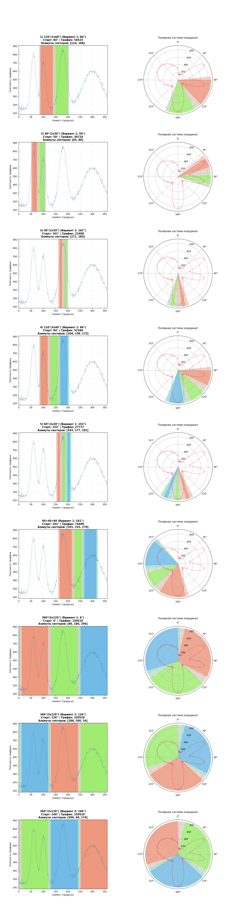

**установка зависимостей**

- pip install uv
- uv sync

**алгоритм рассчёта**

- конвертируем данные из кортежей в словари для быстрого доступа к ним
- для кадлой кофигурации создаём объект кластера и объекты секторов
- для каждого сектора считаем область деградации
- в области деградации учитываем линейное затухание сигнала от краёв области к центру
- для каждого азимута на круге (от 0 до 359) составляем список градусов, которые входят в каждый сектор и области деградации
- отсчёт азимута ведём с левого края левой области деградации левого сектора. это не совсем азимут, но так удобнее
- для каждого сектора+области деградации, по каждому повороту по азимуту считаем сумму траффика
- согласно введённым пользователем параметрам уровня весов(вес неравномерности, вес деградации, вес траффика), считаем наилучшие комбинации
- рисуем графики

**data.py**

- числа переводятся в Decimal
- данные конвертитруются в словарь для быстрого доступа

**decay.py**

считает линейное затухание

**запуск**

- combination_v2.py
- visualization_v1.py (считает только наибольшую зону покрытия с учётом деградации. на вход 1 конфигурация)

### запуск итогового файла combination_v2.py

**переменные**

DEGRADATION_ZONE_WIDTH

- ширины области деградации с каждого края сектора. 
- величина наложения секторов друг на друга = 2*DEGRADATION_ZONE_WIDTH

DEGRADATION_MIN_COEFFICIENT

-коэффициент деградации в середине области деградации

DEGRADATION_MAX_COEFFICIENT

-коэффициент деградации по краям области деградации (1 деградации нет)

IMBALANCE_WEIGHT

- Вес неравномерности
- Если увеличить вес: Алгоритм будет искать такое положение, где трафик распределен по секторам максимально ровно (например, 500/500/500 вместо 1000/10/10).

DEGRADATION_WEIGHT

- Вес деградации
- Если увеличить вес: Алгоритм будет поворачивать антенну так, чтобы пики трафика попадали строго в центральную часть секторов(где нет деградации), даже если это немного снизит общую сумму собранного трафика

TRAFFIC_WEIGHT

- Вес трафика
- Если увеличить вес: Алгоритм будет стремиться собрать абсолютно максимум битов данных, игнорируя перекосы между секторами или попадание в зоны деградации.

### Отчёты

- DEGRADATION_ZONE_WIDTH = 6
- DEGRADATION_MIN_COEFFICIENT = 0.3
- DEGRADATION_MAX_COEFFICIENT = 1
- IMBALANCE_WEIGHT = Decimal('1')
- DEGRADATION_WEIGHT = Decimal('1')
- TRAFFIC_WEIGHT = Decimal('0')

